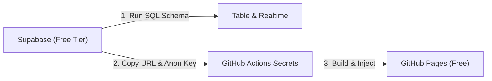

# 🎾 PadelDoodle

> A clean, responsive match availability polling app designed for Padel groups. Hosted **100% free** on **GitHub Pages** and powered by **Supabase** (free tier).

---

## 🌟 Key Features

- **Prefixed Dates**: Automatically generates all **Fridays and Saturdays** from **November 1st until Christmas (Dec 25)**.
- **Multiple Date Selection**: Participants can pick as many dates as they want (with quick shortcuts: *All*, *Fridays only*, *Saturdays only*).
- **Doodle-Style Grid**: Classic matrix table displaying participants in rows and dates across columns, with totals per date and highlighting the most popular match day.
- **Trust-Based System**: No passwords or logins required. Anyone can add their availability or modify anyone else's response across devices.
- **Real-Time Updates**: Leverages Supabase Realtime so votes appear instantly on other players' screens without refreshing.
- **100% Free**: Built to run on GitHub Pages (static site hosting) and Supabase Free Tier.
- **Zero Exposed Secrets**: Supabase connection secrets are stored in GitHub Actions Secrets and injected at build time.

---

## 🚀 Quick Setup Guide

Setting this up requires two free accounts: **Supabase** and **GitHub**.



### 1. Create Free Supabase Project

1. Go to [supabase.com](https://supabase.com) and click **Start your project** (free tier, no credit card required).
2. Click **New Project**:
   - **Name**: `PadelDoodle` (or any name)
   - **Database Password**: Set a strong password
   - **Region**: Choose the region closest to you
3. In the left navigation, click **SQL Editor** &rarr; **New Query**.
4. Paste and run the following script (also found in [`supabase/schema.sql`](file:///Users/mino/Documents/GitHub/PadelDoodle/supabase/schema.sql)):

```sql
-- 1. Create participants table
create table if not exists public.participants (
  id uuid primary key default gen_random_uuid(),
  name text not null,
  selected_dates text[] not null default '{}',
  created_at timestamp with time zone default now(),
  updated_at timestamp with time zone default now()
);

-- 2. Enable Row Level Security (RLS)
alter table public.participants enable row level security;

-- 3. Create trust-based public policies
create policy "Allow public read" 
  on public.participants for select 
  using (true);

create policy "Allow public insert" 
  on public.participants for insert 
  with check (true);

create policy "Allow public update" 
  on public.participants for update 
  using (true) 
  with check (true);

create policy "Allow public delete" 
  on public.participants for delete 
  using (true);

-- 4. Enable Realtime updates
alter publication supabase_realtime add table public.participants;
```

5. Retrieve your project credentials:
   - Click **Project Settings** (gear icon) &rarr; **API** (or **Data API**).
   - Copy **Project URL** (e.g. `https://xxxxxx.supabase.co`).
   - Copy **Project API keys** &rarr; `anon` `public` key (e.g. `eyJhbGciOi...`).

---

### 2. Configure GitHub Repository & Secrets

1. Push this repository to GitHub.
2. In your GitHub repository, navigate to:
   **Settings** &rarr; **Secrets and variables** &rarr; **Actions**.
3. Click **New repository secret** and add:

| Secret Name | Value |
|---|---|
| `VITE_SUPABASE_URL` | Your Supabase Project URL (`https://xxxxxx.supabase.co`) |
| `VITE_SUPABASE_ANON_KEY` | Your Supabase `anon` `public` key (`eyJ...`) |

---

### 3. Enable GitHub Pages

1. In your GitHub repository, go to **Settings** &rarr; **Pages**.
2. Under **Build and deployment**:
   - Set **Source** to **GitHub Actions**.
3. Go to the **Actions** tab, or push a commit to `main`.
4. The workflow in [`.github/workflows/deploy.yml`](file:///Users/mino/Documents/GitHub/PadelDoodle/.github/workflows/deploy.yml) will automatically build and publish your site.
5. Your page will be live at:
   `https://<your-github-username>.github.io/PadelDoodle/`

---

## 💻 Local Development

1. Install dependencies:
   ```bash
   npm install
   ```
2. Create `.env.local` based on `.env.example`:
   ```bash
   cp .env.example .env.local
   ```
   Add your Supabase URL and anon key to `.env.local`.
3. Start local development server:
   ```bash
   npm run dev
   ```
4. Build for production:
   ```bash
   npm run build
   ```

> [!TIP]
> You can also launch the app without `.env.local`! Click the **Settings** gear or the **Setup Required** button in the header to paste your Supabase URL and anon key directly in the browser for instant testing.

---

## 🛡️ Architecture & Security Notes

- **Why is the `anon` key safe to use in frontend?**
  Supabase's `anon` key is designed specifically for client-side queries. Data safety is enforced by **Row Level Security (RLS)**. In this trust-based poll, policies allow read, insert, and update operations for participants without requiring individual user authentication.
- **Atomic updates**: Each participant's selected dates are stored as an array (`text[]`), meaning updating a participant's availability is a clean, single-row update that avoids race conditions or orphaned votes.
